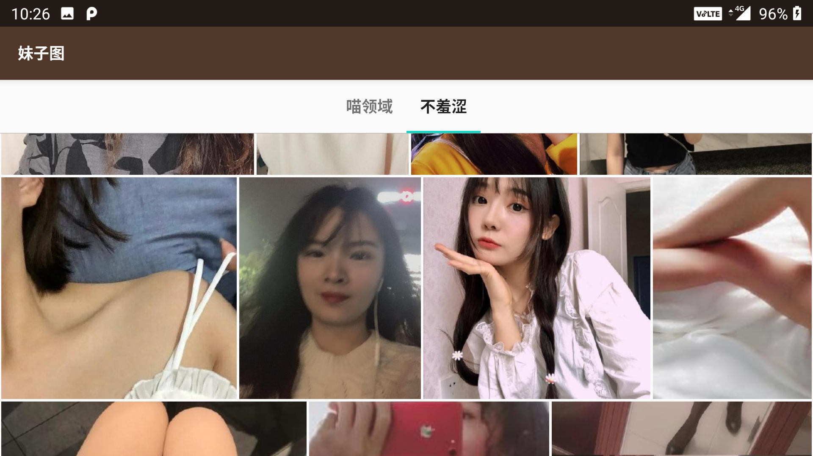

# 妹子图

## 简介

一个简单的看妹子的app demo，自己学习android开发用的。
主要用到下边几个特性

1. mvvm架构：Model <- Repository <- ViewModel <- Fragment，databinding绑定ViewHHolder，以及BindingAdapter
2. paging分页库，DataSource加载网络数据进行分页，用retrofit进行网络请求，返回suspend用协程处理（写了suspend函数还没用到)。获取RecyclerView数据出错时，下拉WwipeRefreshLayout会全部刷新数据，上滑出现局部刷新数据选项，只刷新当前page。第一个页面的错误处理是google的paging demo的处理方式，其他页面还没改
3. Android10的分区存储，Android Q以上存储图片不需要权限，Q以下需要存储权限。在viewmolde里用协程处理图片存储(IO线程存储图片，主线程显示存储结果)
4. 用FlexboxLayout实现瀑布流
5. ViewPager2
6. Jsop进行html解析，有了这个就能再找到很多妹子图库

## 预览

 

## 一些问题

1. 沉浸模式：
为了响应沉浸模式，整个Activity设置了全屏显示，样就需要在非沉浸的fragment里做布局的向下偏移，如果单独给沉浸模式的内容放到一个Activity里会简单很多，或者用Toolbar会简单一些。

2. 瀑布流数据多的时候，如果旋转屏幕，图片加载的会很慢，这个原因需要再查，应该和Glide有关。

3. PhotoListFragment可以抽取一个BasePhotoListFragment，并且RyclcerView的Adapte和item_layout也可以复用一个。

4. Android Studio版本是 3.6，3.5编译不过的可以下个3.6试试。
