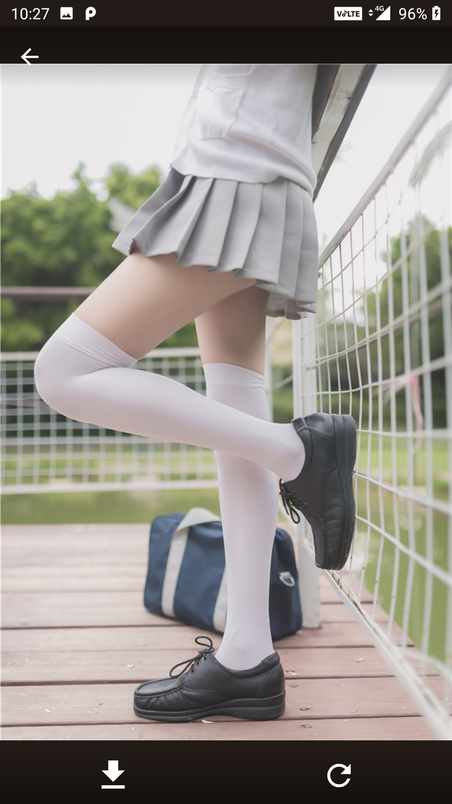

# 妹子图

## 简介

一个简单的看妹子的app demo，自己学习android开发用的。
主要用到下边几个特性

1. mvvm架构：Model <- Repository <- ViewModel <- Fragment，databinding绑定ViewHHolder，以及BindingAdapter
2. paging分页库，DataSource加载网络数据进行分页，用retrofit进行网络请求，返回suspend用协程处理（写了suspeng函数还没用到）
3. Android10的分区存储，Android10以上存储图片不需要权限，10以下需要存储权限
4. 用FlexboxLayout实现瀑布流
5. ViewPager2
6. Jsop进行html解析，有了这个就能再找到很多妹子图库

## 预览

## 一些问题

1. 沉浸模式：
为了响应沉浸模式，整个Activity设置了全屏显示，样就需要在非沉浸的fragment里做布局的向下偏移，如果单独给沉浸模式的内容放到一个Activity里会简单很多，应该用Toolbar会简单一些

2. 分区存储API28以下请求权限也的很乱，并且没有放到ViewModel里，也没有切线程（因为Glide缓存了图片所以存储的很快），以后会把存储图片和请求权限抽取到ViewModel里

3. 瀑布流数据多的时候，如果旋转屏幕，图片加载的会很慢，这个原因需要再查，应该和Glide有关。

4. PhotoListFragment可以抽取一个BasePhotoListFragment，并且RyclcerView的Adapte和item_layout也可以复用一个。
